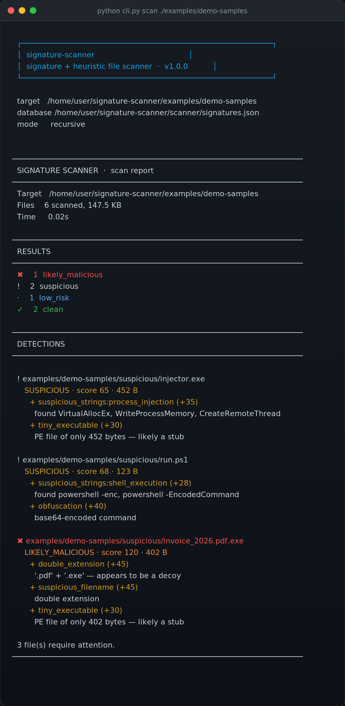

# 🦠 signature-scanner

A **signature and heuristic file scanner** built from scratch in Python — written to understand how antivirus engines actually decide a file is malicious.

> **Source code is private.** This repository is the public showcase: architecture, detection results and sample reports. Happy to walk through the implementation in an interview or on a call.

<p align="left">
  
  
  
  
  
</p>

---

## 🎯 Why this exists

Everyone uses antivirus software. Almost nobody knows how it decides a file is malicious. I wanted to find out, so I built the simplest honest version of the core idea — then measured where it breaks.

That second part is the interesting one. **The weakness isn't a bug, it's the whole approach.** Change one byte of a file and its hash changes completely, so a hash-based scanner sees an entirely new file that it has never seen before.

This project demonstrates that limit with a test, then implements the heuristics real products layer on top to work around it.

---

## 📸 It running



Scanning a directory containing six files. One signature hit, three heuristic detections, two files correctly left alone.

**Full HTML report:** [`sample-report.html`](sample-report.html) — self-contained, no external assets.
**Raw JSON output:** [`sample-report.json`](sample-report.json)

---

## ✨ What it does

| Capability | Detail |
| :--- | :--- |
| **Signature detection** | SHA-256 / SHA-1 / MD5 hash matching against a JSON signature database |
| **Heuristic detection** | Seven scored rules that catch files no signature has ever seen |
| **Quarantine** | Detections are *moved*, never deleted, with metadata so anything can be restored |
| **Three report formats** | Colour terminal output, machine-readable JSON, self-contained HTML |
| **Exit codes** | `0` clean · `1` detections · `2` usage error — gates a CI job |
| **Zero dependencies** | Python standard library only, no `pip install` |

### Commands

```
scan <target>     scan a file or directory   ( --html, --json, --quarantine, -v )
hash <file>       print md5 / sha1 / sha256
add <file>        add a sample's hashes to the signature database
list              show the signature database
quarantine        inspect or restore quarantined files
```

---

## 🔬 The two detection strategies

### 1. Signatures — precise, but blind

A signature is a cryptographic hash of a file's exact contents. A hit is definitive: if the SHA-256 matches, it's the same file.

The limitation is severe:

| Weakness | Why |
| :--- | :--- |
| **Trivial evasion** | Flipping one bit produces a completely different hash |
| **No variants** | Polymorphic malware generates a new hash on every build |
| **Blind to novelty** | A brand-new threat has no signature at all |

This is tested explicitly — one byte changed between two otherwise identical files produces two unrelated hashes.

### 2. Heuristics — fuzzy, but not blind

Heuristics judge *characteristics* rather than identity. Every rule returns a **score and a reason**, never a bare verdict — because heuristics produce false positives, and a scanner that cries wolf gets uninstalled.

| Rule | Score | What it catches |
| :--- | :--- | :--- |
| `double_extension` | 45 | `invoice.pdf.exe` — a decoy extension |
| `suspicious_filename` | 15–45 | Social-engineering names, hex filenames |
| `high_entropy` | 30 | Packed, encrypted or compressed payloads |
| `magic_mismatch` | 50 | A `.jpg` that is really a Windows executable |
| `suspicious_strings:*` | 12–35 | Process injection, credential access, evasion APIs |
| `obfuscation` | 15–40 | Base64 commands, hidden windows, policy bypass |
| `tiny_executable` | 30 | Sub-2 KB PE files — dropper stubs |

Scores accumulate into a verdict:

```
  0        clean
  1 – 39   low_risk
 40 – 69   suspicious
 70 – 99   likely_malicious
 signature hit → malicious   (definitive, not scored)
```

**Detections from the scan above:**

| File | Verdict | Triggered by |
| :--- | :--- | :--- |
| `invoice_2026.pdf.exe` | ✖ **LIKELY_MALICIOUS** | Double extension + lure filename + 402-byte PE stub |
| `injector.exe` | ! **SUSPICIOUS** | `VirtualAllocEx`, `WriteProcessMemory`, `CreateRemoteThread` |
| `run.ps1` | ! **SUSPICIOUS** | `powershell -enc` base64 command + hidden execution |
| `packed.bin` | · **LOW_RISK** | Entropy 7.99/8.00 — packed or encrypted |
| `notes.txt`, `settings.ini` | ✓ **CLEAN** | Nothing triggered |

---

## 🧪 Verification: the EICAR test file

To prove the pipeline works end to end, the scanner recognises the **EICAR test file** — the industry-standard, deliberately harmless string every antivirus product detects.

```
  ✖ test.com
     MALICIOUS · score 100 · 68 B
       SIG EICAR-Test-File (+100)
```

The test string is **generated at runtime** by the test suite rather than committed, because committing it causes some scanners, CI systems and hosting providers to flag the repository itself.

---

## ✅ Test suite

```
Ran 33 tests in 0.059s
OK
```

Coverage includes hash correctness, entropy bounds, single-byte hash divergence, every heuristic rule, signature matching across all three algorithms, directory traversal, summary arithmetic, quarantine move/restore, and HTML report escaping.

Two tests exist specifically to document properties I care about:

- `test_single_byte_change_alters_hash_completely` — proves why signatures alone fail
- `test_quarantine_never_deletes` — a false positive must never destroy a file

---

## 🗄️ Design decisions

**Quarantine, not deletion.** A scanner that deletes on a false positive has destroyed a user's file; one that quarantines has merely moved it. Every quarantined file gets a JSON sidecar recording its original path, verdict, score and hashes, so restoration is exact. This is why every real AV product quarantines, and it's what this does.

**Scored verdicts, not binary ones.** Reporting "malicious" when you're 60% sure trains users to ignore you. Every detection states its score and the evidence behind it.

**HTML escaping.** Report filenames are attacker-controlled — a file can be named `<script>…`. The HTML renderer escapes all user-supplied paths, verified by a test that scans a file with a script tag in its name.

**Failing heuristics don't abort scans.** A single unreadable file must not kill a directory scan, so every rule is individually guarded.

---

## 🗂️ Architecture

```
cli.py              argparse entrypoint — scan / hash / add / list / quarantine
scanner/
  hasher.py         hashing, entropy, magic numbers, safe directory traversal
  heuristics.py     the seven scored detection rules
  detector.py       orchestration + ScanResult model
  quarantine.py     move/restore with metadata sidecars
  report.py         terminal, JSON and HTML renderers
  signatures.json   signature database
```

The split matters: detection logic is importable and testable without going through the CLI, which is why the test suite can exercise every rule directly.

---

## ⚠️ Limitations — stated honestly

- **Heuristics produce false positives.** A legitimate installer packed with UPX will trip `high_entropy`. This is unavoidable, which is why output is scored rather than binary.
- **No unpacking.** Packed samples are flagged, not analysed. Real engines emulate or sandbox.
- **No emulation or sandboxing.** Behaviour is inferred from static content only.
- **The signature set is a demo.** Three entries, one of them EICAR. Real detection needs a maintained feed.
- **No archive scanning.** Files inside ZIPs are not inspected.
- **Not for production use.** This is a learning project. Use a real AV/EDR product to protect a machine.

---

## 🗺️ Roadmap

- [ ] Recursive archive inspection (ZIP, RAR, 7z)
- [ ] YARA rule support for pattern-based signatures
- [ ] PE header parsing — sections, import table, compile timestamp
- [ ] Parallel scanning across CPU cores
- [ ] Fuzzy hashing (ssdeep) to catch near-identical variants
- [ ] Watch mode for continuous directory monitoring
- [ ] Signature feeds from public threat intel

---

## ⚖️ Responsible use

This tool is **defensive**. It inspects files and reports findings; it does not create, modify or deploy anything malicious. Any test sample must be handled inside an isolated VM with no network access.

---

## 📄 License

MIT — documentation and sample reports in this repository are free to use and reference.

---

<p align="center"><sub>Built by <a href="https://github.com/vinaynayak2007">Vinay N</a> · Cyber Security @ Alliance University · <a href="https://vinunayak.pages.dev">vinunayak.pages.dev</a></sub></p>
